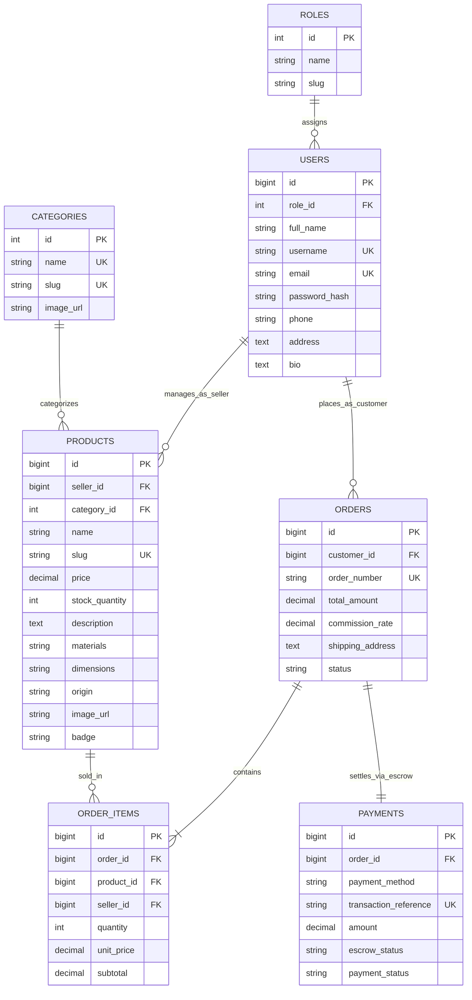
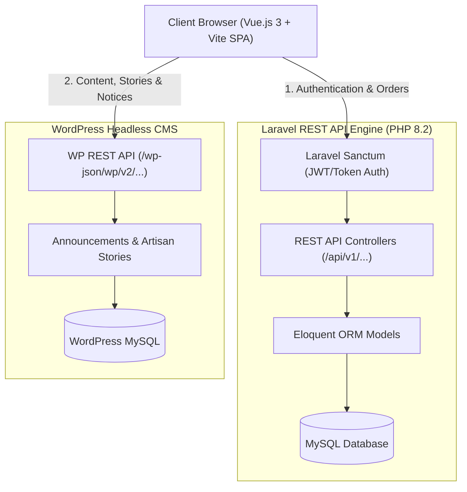

# CraftMarket - Entity Relationship Diagram & Architecture

## 1. Relational Database Schema (ERD)

```mermaid
erDiagram
    ROLES ||--o{ USERS : assigns
    USERS ||--o{ PRODUCTS : manages_as_seller
    CATEGORIES ||--o{ PRODUCTS : categorizes
    USERS ||--o{ ORDERS : places_as_customer
    ORDERS ||--|{ ORDER_ITEMS : contains
    PRODUCTS ||--o{ ORDER_ITEMS : sold_in
    ORDERS ||--|| PAYMENTS : settles_via_escrow

    ROLES {
        int id PK
        string name
        string slug
    }

    USERS {
        bigint id PK
        int role_id FK
        string full_name
        string username UK
        string email UK
        string password_hash
        string phone
        text address
        text bio
    }

    CATEGORIES {
        int id PK
        string name UK
        string slug UK
        string image_url
    }

    PRODUCTS {
        bigint id PK
        bigint seller_id FK
        int category_id FK
        string name
        string slug UK
        decimal price
        int stock_quantity
        text description
        string materials
        string dimensions
        string origin
        string image_url
        string badge
    }

    ORDERS {
        bigint id PK
        bigint customer_id FK
        string order_number UK
        decimal total_amount
        decimal commission_rate
        text shipping_address
        string status
    }

    ORDER_ITEMS {
        bigint id PK
        bigint order_id FK
        bigint product_id FK
        bigint seller_id FK
        int quantity
        decimal unit_price
        decimal subtotal
    }

    PAYMENTS {
        bigint id PK
        bigint order_id FK
        string payment_method
        string transaction_reference UK
        decimal amount
        string escrow_status
        string payment_status
    }
```

---

## 2. Distributed Three-Tier System Architecture

```mermaid
flowchart TD
    Client["Client Browser (Vue.js 3 + Vite SPA)"]

    subgraph LaravelBackend["Laravel REST API Engine (PHP 8.2)"]
        Sanctum["Laravel Sanctum (JWT/Token Auth)"]
        ApiRoutes["REST API Controllers (/api/v1/...)"]
        Eloquent["Eloquent ORM Models"]
        DB[(MySQL Database)]
    end

    subgraph WordPressHeadless["WordPress Headless CMS"]
        WPRest["WP REST API (/wp-json/wp/v2/...)"]
        WPContent["Announcements & Artisan Stories"]
        WPDB[(WordPress MySQL)]
    end

    Client -->|1. Authentication & Orders| Sanctum
    Sanctum --> ApiRoutes
    ApiRoutes --> Eloquent
    Eloquent --> DB

    Client -->|2. Content, Stories & Notices| WPRest
    WPRest --> WPContent
    WPContent --> WPDB
```
